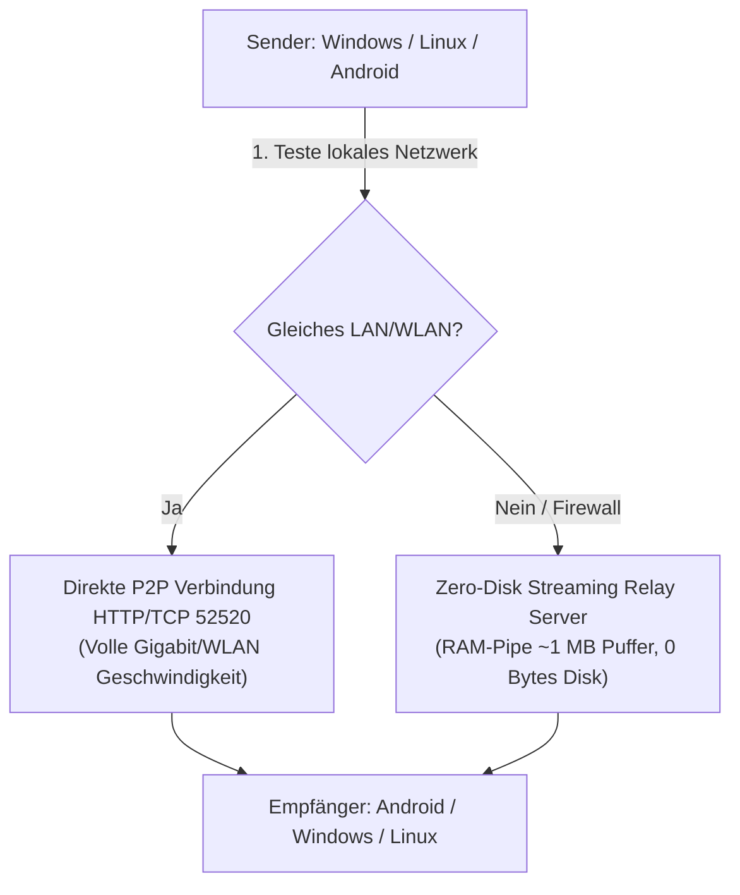

# CrossDrop 🚀

> **Schneller, sicherer und grenzenloser Datentransfer zwischen Windows, Linux, Android, Nextcloud & Google Drive.**  
> Übertragen Sie einzelne Dateien, ganze Ordner und bis zu 5.000 Dateien blitzschnell im lokalen Netzwerk (LAN / WLAN), über den integrierten VPN-Tunnel oder synchronisieren Sie diese direkt mit Ihrer **Nextcloud, WebDAV oder Google Drive**.

---

## 📥 Downloads (Aktuelle Version 1.4.1)

Wählen Sie einfach Ihr Betriebssystem aus und laden Sie die passende Version herunter:

| Plattform | Dateityp | GitHub-Download | Schneller Server-Spiegel |
| :--- | :--- | :--- | :--- |
| 🪟 **Windows 10 / 11** | Setup-Installer (`.exe`) | [⬇️ CrossDrop-Windows-Setup.exe](https://github.com/BuzziGHG/crossdrop/releases/latest/download/CrossDrop-Windows-Setup.exe) *(Empfohlen)* | [⚡ Direktdownload](http://82.29.5.240:2603/api/updates/download/windows) |
| 🪟 **Windows (Portabel)** | ZIP-Archiv | [⬇️ CrossDrop-Windows-x64.zip](https://github.com/BuzziGHG/crossdrop/releases/latest/download/CrossDrop-Windows-x64.zip) | - |
| 🐧 **Linux (Debian / Ubuntu)** | Paket (`.deb`) | [⬇️ crossdrop_1.4.1_amd64.deb](https://github.com/BuzziGHG/crossdrop/releases/latest/download/crossdrop_1.4.1_amd64.deb) | [⚡ Direktdownload](http://82.29.5.240:2603/api/updates/download/linux) |
| 📱 **Android** | App-Paket (`.apk`) | [⬇️ crossdrop-release.apk](https://github.com/BuzziGHG/crossdrop/releases/latest/download/crossdrop-release.apk) | [⚡ Direktdownload](http://82.29.5.240:2603/api/updates/download/android) |

👉 **[Alle Downloads und Versionshinweise auf der Release-Seite ansehen](https://github.com/BuzziGHG/crossdrop/releases)**

---

## ✨ Was ist neu in Version 1.4.1?

- 🛠️ **Nextcloud WebDAV 404 Download-Fix:**
  - Behebt das Problem, dass Downloads aus Nextcloud mit HTTP 404 abbrachen: Durch eine neue universelle URI-Erkennung wird die Verdoppelung des WebDAV-Basispfads (`/remote.php/dav/files/...`) verhindert.
- 🖼️ **In-App Dateivorschau & Betrachter („Direkt in der App ansehen“):**
  - **Integrierter Bildbetrachter:** Schnelles Öffnen und Betrachten von Bildern (JPG, PNG, GIF, WEBP, SVG) direkt in der App mit Zoom & Pan (`InteractiveViewer`).
  - **Text- & Code-Viewer:** Scrollbare Monospace-Vorschau für Text-, Log- und Quellcodedateien (TXT, MD, JSON, CSV, XML, Dart, Python) mit Kopierfunktion.
  - **Dokumenten-Öffnen:** Ein Klick auf PDFs oder Office-Dokumente öffnet die Datei sofort in der jeweiligen System-Standard-App.
  - **Aktionsmenü:** Vorschau, Speichern in Downloads, Direktes Weiterleiten per CrossDrop an andere Geräte oder Löschen.
- 📁 **Google Drive & Google-Konto-Anbindung:**
  - Direkte Verknüpfung von Google Drive über Google OAuth-Tokens.
  - Vollständige Integration der Google Drive REST API v3 zum Durchsuchen, Herunterladen, Betrachten und Hochladen von Dateien.
- 📦 **Stapel-Übertragung & Ordnerversand (bis zu 5.000 Dateien aus v1.4.0):**
  - Gleichzeitiger Versand von bis zu 5.000 Dateien im LAN, über Server-Relay oder im Cloud-Upload mit aggregiertem Gesamtfortschritt.

---

## ⚡ Schnellstart: In 3 Schritten zur ersten Dateiübertragung

### 1. App installieren & starten
- **Windows:** `CrossDrop-Windows-Setup.exe` ausführen (erstellt automatisch ein Startmenü- und Desktop-Icon).
- **Linux:** Paket per Doppelklick oder mit `sudo dpkg -i crossdrop_1.3.0_amd64.deb` installieren.
- **Android:** `crossdrop-release.apk` herunterladen und antippen (Installation aus vertrauenswürdigen Quellen aktivieren).

### 2. Kostenlosen Account erstellen & anmelden
- Beim ersten Start auf **„Noch kein Konto? Hier registrieren“** tippen.
- E-Mail-Adresse, Benutzernamen und ein persönliches Passwort festlegen.
- *(Die Server-Adresse `http://82.29.5.240:2603` ist in der App bereits vorkonfiguriert – keine manuelle Einrichtung nötig!)*

### 3. Dateien senden
- Wählen Sie im Menü **„Dateien senden“** beliebige Dokumente, Bilder oder Videos aus.
- Wählen Sie Ihr gewünschtes Zielgerät aus der Geräteliste oder geben Sie die E-Mail-Adresse eines Freundes ein.
- Die Übertragung startet sofort mit synchroner Live-Fortschrittsanzeige!

---

## 🛠️ Technische Architektur

CrossDrop kombiniert modernste Übertragungstechnologien für maximale Geschwindigkeit und Sicherheit:

1. **Priorität 1 – Lokales Netzwerk (LAN / WLAN):**
   Direkter Peer-to-Peer Stream über TCP/HTTP Port 52520 mit nativer Netzwerkgeschwindigkeit (ohne Umweg über das Internet).
2. **Priorität 2 – VPN Server-Relay (Zero-Disk):**
   Befinden sich die Geräte in verschiedenen Netzwerken, Mobilfunk oder hinter restriktiven Firewalls, streamt CrossDrop über die integrierte WebSocket- und Streaming-Pipeline im Arbeitsspeicher des Servers.
3. **Sicherheit:**
   Vollständige SHA-256 Integritätsprüfung nach Abschluss jedes Dateitransfers.

---

## 📄 Lizenz

Entwickelt mit Flutter (Frontend) und FastAPI / Python (Backend).  
Open Source lizenziert unter der [MIT-Lizenz](LICENSE).
