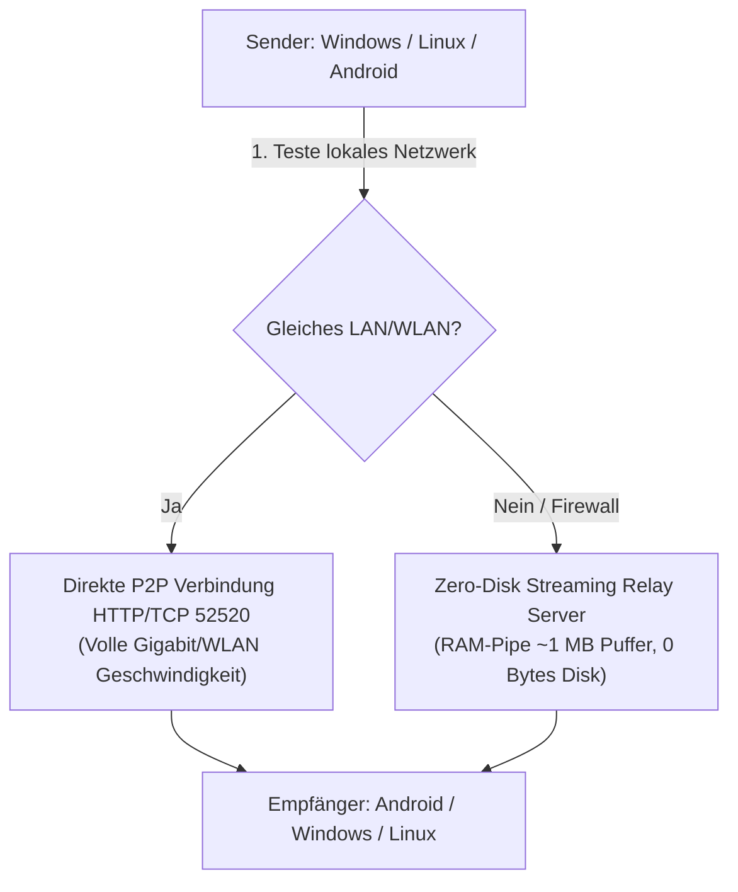

# CrossDrop 🚀

> **Schneller, sicherer und grenzenloser Datentransfer zwischen Windows, Linux, Android und Cloud.**  
> Übertragen Sie einzelne Dateien, ganze Ordner und bis zu 5.000 Dateien blitzschnell im lokalen Netzwerk (LAN / WLAN), über den integrierten VPN-Tunnel oder synchronisieren Sie diese direkt mit Ihrer persönlichen **Nextcloud / WebDAV**.

---

## 📥 Downloads (Aktuelle Version 1.4.0)

Wählen Sie einfach Ihr Betriebssystem aus und laden Sie die passende Version herunter:

| Plattform | Dateityp | GitHub-Download | Schneller Server-Spiegel |
| :--- | :--- | :--- | :--- |
| 🪟 **Windows 10 / 11** | Setup-Installer (`.exe`) | [⬇️ CrossDrop-Windows-Setup.exe](https://github.com/BuzziGHG/crossdrop/releases/latest/download/CrossDrop-Windows-Setup.exe) *(Empfohlen)* | [⚡ Direktdownload](http://82.29.5.240:2603/api/updates/download/windows) |
| 🪟 **Windows (Portabel)** | ZIP-Archiv | [⬇️ CrossDrop-Windows-x64.zip](https://github.com/BuzziGHG/crossdrop/releases/latest/download/CrossDrop-Windows-x64.zip) | - |
| 🐧 **Linux (Debian / Ubuntu)** | Paket (`.deb`) | [⬇️ crossdrop_1.4.0_amd64.deb](https://github.com/BuzziGHG/crossdrop/releases/latest/download/crossdrop_1.4.0_amd64.deb) | [⚡ Direktdownload](http://82.29.5.240:2603/api/updates/download/linux) |
| 📱 **Android** | App-Paket (`.apk`) | [⬇️ crossdrop-release.apk](https://github.com/BuzziGHG/crossdrop/releases/latest/download/crossdrop-release.apk) | [⚡ Direktdownload](http://82.29.5.240:2603/api/updates/download/android) |

👉 **[Alle Downloads und Versionshinweise auf der Release-Seite ansehen](https://github.com/BuzziGHG/crossdrop/releases)**

---

## ✨ Was ist neu in Version 1.4.0?

- ☁️ **Cloud-Synchronisation (Nextcloud & WebDAV):**
  - **Eigene Cloud einbinden:** Verbinden Sie Ihre private Nextcloud oder jeden beliebigen WebDAV-Server ganz einfach über IP-Adresse / Domain, Benutzername und Passwort oder App-Token.
  - **Live-Verbindungstest:** Direkte Prüfung der Erreichbarkeit und Zugangsdaten direkt in der App per Knopfdruck.
  - **Integrierter Cloud-Dateimanager:** Eigener Reiter in der App zum Durchsuchen Ihrer Nextcloud-Ordner, Anlegen neuer Ordner, Herunterladen von Dateien auf das lokale Gerät und Löschen nicht mehr benötigter Daten.
  - **Direktes Hochladen in die Cloud:** Im Senden-Menü können Dateien oder Ordner direkt in Ihr gewünschtes Nextcloud-Verzeichnis geladen werden – ohne zusätzliche Software.
- 📦 **Stapel-Übertragung & Ordnerversand (bis zu 5.000 Dateien):**
  - **Massentransfer:** Versenden Sie nicht mehr nur einzelne Dateien, sondern markieren Sie hunderte oder tausende Dateien auf einmal oder wählen Sie einfach einen kompletten Ordner aus.
  - **Echtzeit-Stapelfortschritt:** Der Fortschrittsbalken fasst alle Dateien zusammen und zeigt genau an: *„Datei 142 von 1.500 – 45% (1.2 GB / 2.8 GB)“* inklusive Übertragungsrate und verbleibender Zeit.
  - Unterstützt im lokalen Netzwerk (LAN P2P), über weltweites VPN/Relay sowie im Cloud-Upload.
- 🔔 **Android Benachrichtigungs-Optimierung (Single Unified Notification):**
  - Saubere Benachrichtigungsleiste ohne Duplikate oder Aufploppen beim Wegwischen.
  - Native Vordergrund-Dienst-Integration (`TransferForegroundService`) mit `PARTIAL_WAKE_LOCK` und `WifiLock` für ununterbrochene Transfers im Hintergrund.
- 🛑 **Plattformübergreifendes Abbrechen von Dateiübertragungen:**
  - Neue **"Abbrechen"**-Buttons in Dashboard, Transfers-Screen und Dialogen zum sofortigen Stoppen und Bereinigen von Transfers.
- 💾 **Zero-Disk In-Memory Streaming Relay:**
  - 100 % RAM-Streaming über `RelayPipe` – 0 Byte Server-Festplattenbelegung für grenzenlose Übertragungen ohne Speicherengpässe.

---

## ⚡ Schnellstart: In 3 Schritten zur ersten Dateiübertragung

### 1. App installieren & starten
- **Windows:** `CrossDrop-Windows-Setup.exe` ausführen (erstellt automatisch ein Startmenü- und Desktop-Icon).
- **Linux:** Paket per Doppelklick oder mit `sudo dpkg -i crossdrop_1.3.0_amd64.deb` installieren.
- **Android:** `crossdrop-release.apk` herunterladen und antippen (Installation aus vertrauenswürdigen Quellen aktivieren).

### 2. Kostenlosen Account erstellen & anmelden
- Beim ersten Start auf **„Noch kein Konto? Hier registrieren“** tippen.
- E-Mail-Adresse, Benutzernamen und ein persönliches Passwort festlegen.
- *(Die Server-Adresse `http://82.29.5.240:2603` ist in der App bereits vorkonfiguriert – keine manuelle Einrichtung nötig!)*

### 3. Dateien senden
- Wählen Sie im Menü **„Dateien senden“** beliebige Dokumente, Bilder oder Videos aus.
- Wählen Sie Ihr gewünschtes Zielgerät aus der Geräteliste oder geben Sie die E-Mail-Adresse eines Freundes ein.
- Die Übertragung startet sofort mit synchroner Live-Fortschrittsanzeige!

---

## 🛠️ Technische Architektur

CrossDrop kombiniert modernste Übertragungstechnologien für maximale Geschwindigkeit und Sicherheit:

1. **Priorität 1 – Lokales Netzwerk (LAN / WLAN):**
   Direkter Peer-to-Peer Stream über TCP/HTTP Port 52520 mit nativer Netzwerkgeschwindigkeit (ohne Umweg über das Internet).
2. **Priorität 2 – VPN Server-Relay (Zero-Disk):**
   Befinden sich die Geräte in verschiedenen Netzwerken, Mobilfunk oder hinter restriktiven Firewalls, streamt CrossDrop über die integrierte WebSocket- und Streaming-Pipeline im Arbeitsspeicher des Servers.
3. **Sicherheit:**
   Vollständige SHA-256 Integritätsprüfung nach Abschluss jedes Dateitransfers.

---

## 📄 Lizenz

Entwickelt mit Flutter (Frontend) und FastAPI / Python (Backend).  
Open Source lizenziert unter der [MIT-Lizenz](LICENSE).
