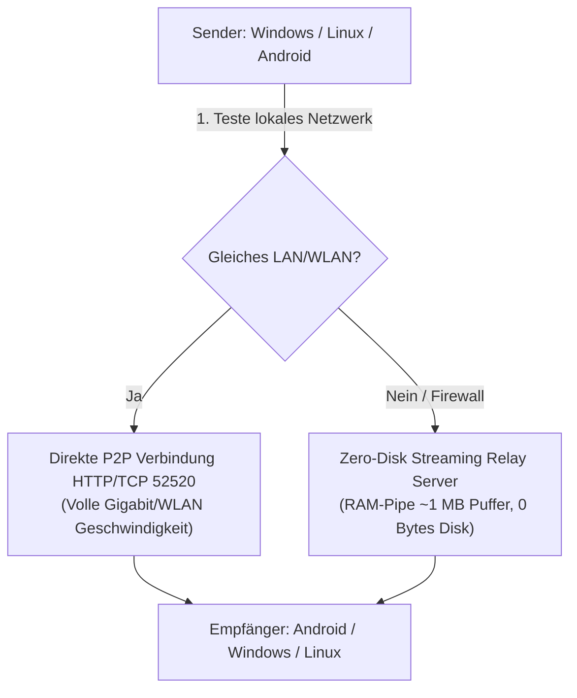

# CrossDrop 🚀

> **Schneller, sicherer und grenzenloser Datentransfer zwischen Windows, Linux und Android.**  
> Übertragen Sie Dateien und Ordner jeder Größe blitzschnell im lokalen Netzwerk (LAN / WLAN) oder automatisch über den integrierten VPN-Tunnel und das Zero-Disk Streaming-Relay – weltweit und ohne Router-Konfiguration.

---

## 📥 Downloads (Aktuelle Version 1.3.2)

Wählen Sie einfach Ihr Betriebssystem aus und laden Sie die passende Version herunter:

| Plattform | Dateityp | GitHub-Download | Schneller Server-Spiegel |
| :--- | :--- | :--- | :--- |
| 🪟 **Windows 10 / 11** | Setup-Installer (`.exe`) | [⬇️ CrossDrop-Windows-Setup.exe](https://github.com/BuzziGHG/crossdrop/releases/latest/download/CrossDrop-Windows-Setup.exe) *(Empfohlen)* | [⚡ Direktdownload](http://82.29.5.240:2603/api/updates/download/windows) |
| 🪟 **Windows (Portabel)** | ZIP-Archiv | [⬇️ CrossDrop-Windows-x64.zip](https://github.com/BuzziGHG/crossdrop/releases/latest/download/CrossDrop-Windows-x64.zip) | - |
| 🐧 **Linux (Debian / Ubuntu)** | Paket (`.deb`) | [⬇️ crossdrop_1.3.2_amd64.deb](https://github.com/BuzziGHG/crossdrop/releases/latest/download/crossdrop_1.3.2_amd64.deb) | [⚡ Direktdownload](http://82.29.5.240:2603/api/updates/download/linux) |
| 📱 **Android** | App-Paket (`.apk`) | [⬇️ crossdrop-release.apk](https://github.com/BuzziGHG/crossdrop/releases/latest/download/crossdrop-release.apk) | [⚡ Direktdownload](http://82.29.5.240:2603/api/updates/download/android) |

👉 **[Alle Downloads und Versionshinweise auf der Release-Seite ansehen](https://github.com/BuzziGHG/crossdrop/releases)**

---

## ✨ Was ist neu in Version 1.3.2?

- 📱 **Android Hintergrund-Service & Verbindungsstabilität (WakeLock & WifiLock):**
  - Datenübertragungen auf Android brechen beim Wechsel in eine andere App, beim Ausschalten des Bildschirms oder beim Verlassen der App nicht mehr ab!
  - Native Registrierung als `TransferForegroundService` mit `foregroundServiceType="dataSync"`, CPU-`PARTIAL_WAKE_LOCK` und Low-Latency `WifiLock`.
  - Intelligentes `PopScope` fängt die Android Zurück-Taste am Hauptbildschirm ab und minimiert die App per `moveTaskToBack(true)` sicher in den Hintergrund, anstatt den Prozess zu beenden.
- 🛑 **Plattformübergreifendes Abbrechen von Dateiübertragungen:**
  - Neue **"Abbrechen"**-Schaltflächen in der Übertragungsübersicht, im Dashboard-Banner und im Übertragungs-Dialog auf allen Plattformen (Windows, Linux, Android).
  - Sofortiges Schließen der Socket-Verbindungen, Bereinigung unvollständiger temporärer Dateien und synchrone Benachrichtigung des Partners (`transfer_cancelled`).
- 📱 **Android In-App Update & Paket-Installer (aus v1.3.1):**
  - Eigener nativer MethodChannel für den Android-System-Installer (`ACTION_VIEW`) mit FileProvider.
- 💾 **Zero-Disk In-Memory Streaming Relay:**
  - Datenübertragungen verbrauchen 0 Byte Server-Festplatte dank RAM-Pipeline (`RelayPipe`).
- 📊 **100 % synchrone Live-Fortschrittsanzeige:**
  - Sender und Empfänger sehen in Echtzeit synchron denselben Fortschritt (0–100 %), exakt identische Geschwindigkeiten und Restzeiten (ETA).

---

## ⚡ Schnellstart: In 3 Schritten zur ersten Dateiübertragung

### 1. App installieren & starten
- **Windows:** `CrossDrop-Windows-Setup.exe` ausführen (erstellt automatisch ein Startmenü- und Desktop-Icon).
- **Linux:** Paket per Doppelklick oder mit `sudo dpkg -i crossdrop_1.3.0_amd64.deb` installieren.
- **Android:** `crossdrop-release.apk` herunterladen und antippen (Installation aus vertrauenswürdigen Quellen aktivieren).

### 2. Kostenlosen Account erstellen & anmelden
- Beim ersten Start auf **„Noch kein Konto? Hier registrieren“** tippen.
- E-Mail-Adresse, Benutzernamen und ein persönliches Passwort festlegen.
- *(Die Server-Adresse `http://82.29.5.240:2603` ist in der App bereits vorkonfiguriert – keine manuelle Einrichtung nötig!)*

### 3. Dateien senden
- Wählen Sie im Menü **„Dateien senden“** beliebige Dokumente, Bilder oder Videos aus.
- Wählen Sie Ihr gewünschtes Zielgerät aus der Geräteliste oder geben Sie die E-Mail-Adresse eines Freundes ein.
- Die Übertragung startet sofort mit synchroner Live-Fortschrittsanzeige!

---

## 🛠️ Technische Architektur

CrossDrop kombiniert modernste Übertragungstechnologien für maximale Geschwindigkeit und Sicherheit:

1. **Priorität 1 – Lokales Netzwerk (LAN / WLAN):**
   Direkter Peer-to-Peer Stream über TCP/HTTP Port 52520 mit nativer Netzwerkgeschwindigkeit (ohne Umweg über das Internet).
2. **Priorität 2 – VPN Server-Relay (Zero-Disk):**
   Befinden sich die Geräte in verschiedenen Netzwerken, Mobilfunk oder hinter restriktiven Firewalls, streamt CrossDrop über die integrierte WebSocket- und Streaming-Pipeline im Arbeitsspeicher des Servers.
3. **Sicherheit:**
   Vollständige SHA-256 Integritätsprüfung nach Abschluss jedes Dateitransfers.

---

## 📄 Lizenz

Entwickelt mit Flutter (Frontend) und FastAPI / Python (Backend).  
Open Source lizenziert unter der [MIT-Lizenz](LICENSE).
